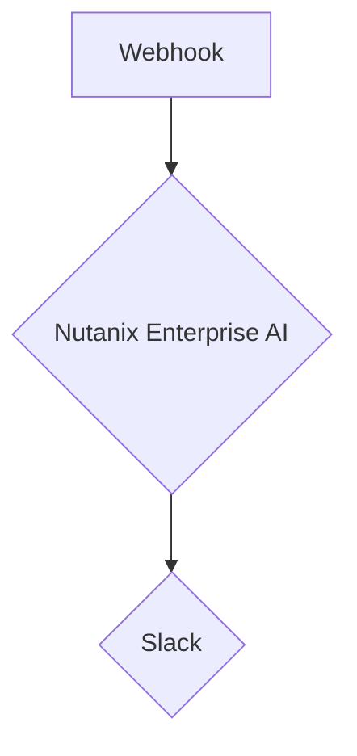

# n8n Introduction

In this section, we will introduce you to n8n, a low-code/no-code workflow automation tool. We will explore how you can use n8n to build powerful workflows that integrate with Nutanix Enterprise AI.

## What is n8n?

n8n is an open-source, self-hostable workflow automation tool that allows you to connect different applications and services to automate tasks. It provides a visual interface for building workflows, making it easy to create complex automations without writing any code.

## How can n8n be used with Nutanix Enterprise AI?

You can use n8n to build workflows that leverage the power of Nutanix Enterprise AI. For example, you can create a workflow that automatically:

*   Analyzes customer feedback from a survey and sends a summary to your team in Slack.
*   Generates a personalized email response to a customer inquiry.
*   Creates a new virtual machine in Nutanix Prism Central based on a natural language request.

## Workflow Example

The following diagram illustrates an example of an n8n workflow that integrates with Nutanix Enterprise AI:

1.  **Webhook**: The workflow is triggered by a webhook, which is a a web-based event notification.
2.  **Nutanix Enterprise AI**: The workflow sends a prompt to the Nutanix Enterprise AI inference endpoint.
3.  **Slack**: The workflow sends the response from the inference endpoint to a Slack channel.

## Building a Workflow

In the next section, we will walk you through the process of building a workflow with n8n. Here are the high-level steps:

1.  **Create a new workflow**: You will create a new workflow in the n8n application.
2.  **Add nodes to the workflow**: You will add and configure the necessary nodes to create your workflow.
3.  **Test the workflow**: You will test your workflow to ensure that it is working correctly.

