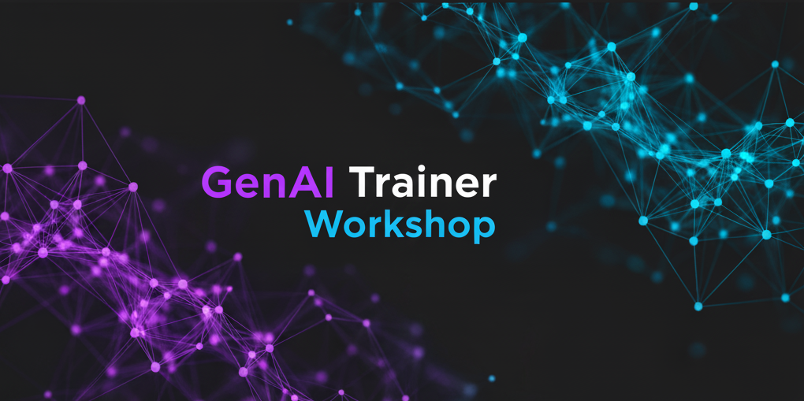

# Welcome to the Nutanix Enterprise AI Workshop

This two-day, hands-on workshop is designed to equip you with the knowledge and skills to understand, deploy, and manage Nutanix Enterprise AI. You will gain a deep understanding of the NAI architecture, its core components, and how to leverage it to build and deploy generative AI applications.

Throughout this workshop, you will engage in a series of presentations, live demonstrations, and hands-on labs. You will learn how to:

*   Understand the value proposition of Nutanix Enterprise AI
*   Deploy and configure the Nutanix Kubernetes Platform (NKP)
*   Install and manage Nutanix Enterprise AI
*   Import and deploy Large Language Models (LLMs)
*   Build and deploy a RAG-based chatbot using Flowise
*   Prepare your own environment for delivering NAI workshops

We are excited to have you here and look forward to a productive and engaging workshop.md engaging and productive workshop.
