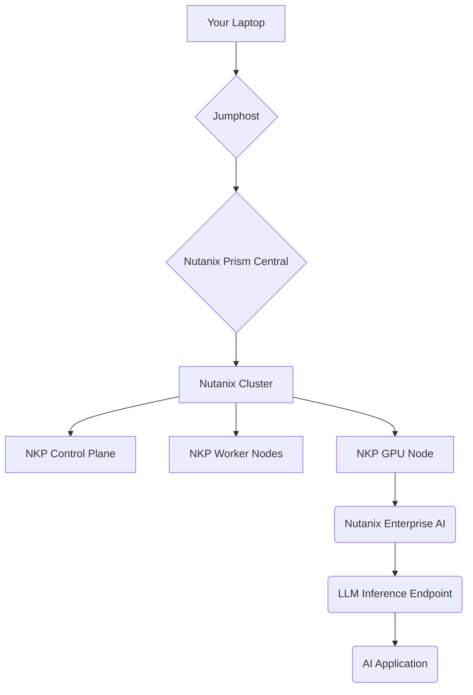

# Lab Environment

This workshop will be conducted in a dedicated lab environment designed to provide you with a hands-on experience with Nutanix Enterprise AI. The lab environment consists of the following components:

## Hosted POC (HPOC)

The foundation of our lab is a Nutanix Hosted POC (HPOC). This cluster is specifically configured to handle the demanding storage and performance requirements of AI workloads. It provides a scalable and resilient storage solution for your models, data, and applications.

## Nutanix Kubernetes Platform (NKP)

We will be using the Nutanix Kubernetes Platform (NKP) to deploy and manage our containerized AI applications. NKP is a CNCF-certified Kubernetes distribution that is tightly integrated with the Nutanix Cloud Platform. It simplifies the deployment and management of Kubernetes clusters, allowing you to focus on your applications rather than the underlying infrastructure.

## Lab Architecture

The lab environment is designed to mirror a real-world deployment of Nutanix Enterprise AI. The following diagram illustrates the high-level architecture of our lab:

### Your Laptop

You will access the lab environment from your laptop. You will need to have the following tools installed:

*   A modern web browser (Chrome, Firefox, or Edge)
*   An SSH client
*   `kubectl`

### Jumphost

The jumphost is a virtual machine that serves as a secure entry point to the lab environment. You will connect to the jumphost via SSH to access the various components of the lab.

### Nutanix Prism Central

Nutanix Prism Central is the centralized management interface for the Nutanix Cloud Platform. You will use Prism Central to monitor and manage the Nutanix cluster, including the NKP cluster and the underlying virtual infrastructure.

### Nutanix Cluster

The Nutanix cluster is the core of our lab environment. It provides the compute, storage, and networking resources for our AI workloads.

### NKP Cluster

The Nutanix Kubernetes Platform (NKP) cluster is where we will deploy our AI applications. The cluster consists of the following components:

*   **Control Plane**: The control plane is responsible for managing the Kubernetes cluster.
*   **Worker Nodes**: The worker nodes are where our application containers run.
*   **GPU Node**: The GPU node is a specialized worker node that is equipped with a powerful NVIDIA GPU. This node is used to run our Large Language Models (LLMs).

### Nutanix Enterprise AI

Nutanix Enterprise AI is the heart of our lab. It is a software-defined AI platform that simplifies the deployment and management of AI workloads. You will use NAI to import and deploy LLMs, create inference endpoints, and manage your AI applications.

### LLM Inference Endpoint

The LLM inference endpoint is a secure API endpoint that exposes our deployed Large Language Model. Your AI applications will use this endpoint to make inference requests.

### AI Application

We will be building and deploying a simple AI-powered chatbot that uses the LLM inference endpoint to answer questions.

