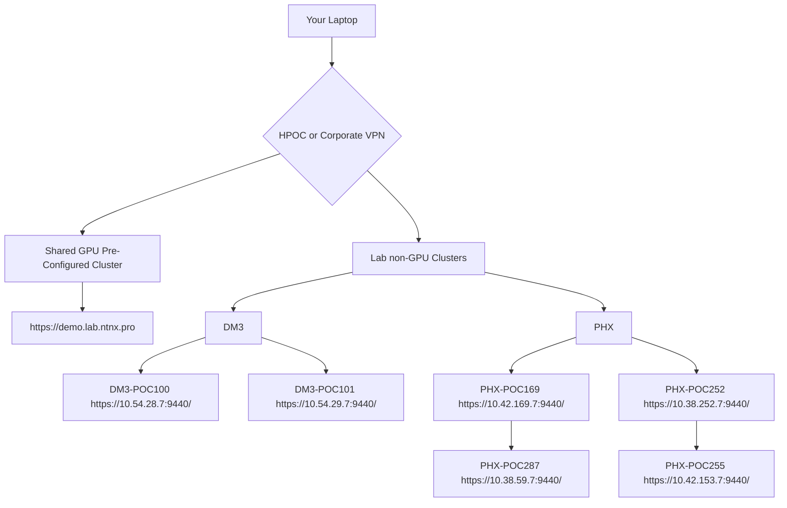

# Lab Environment

This workshop will be conducted in a dedicated lab environment designed to provide you with a hands-on experience with Nutanix Enterprise AI. The lab environment consists of the following components:

## Lab Architecture

The lab environment is designed to mirror a real-world deployment of Nutanix Enterprise AI. The following diagram illustrates the high-level architecture of our lab:

## POC Details

For detailed information about the lab environment, please refer to the POC detail sheet:

[POC Detail Sheet](https://docs.google.com/spreadsheets/d/17cVonaeUtIgAknOf8mUVkzwVG4BWZxwI6LtU5jMmTr8/edit?usp=sharing)

## Default Credentials

The default credentials for the GPU clusters are:

- **Username**: `admin`
- **Password**: `nx2Tech911!`

